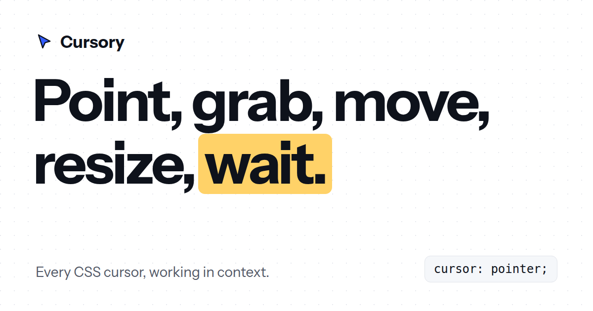

# Cursory

An interactive reference for the CSS `cursor` property. Each value runs inside a working interface, next to the exact line of CSS you need.

**Live:** https://aowshad.github.io/cursory/



## What's inside

- **All 36 cursor keywords plus `url()`.** Values are grouped the way the CSS UI Level 4 spec groups them, and each one has a live, real-world demo and a one-click copy.
- **Cursor Studio** (`builder.html`). A full-page editor for custom cursors, with settings panels inspired by macOS. Start from a 14-cursor library or upload an SVG, PNG, JPG or WebP and crop it. Adjust size, fill and outline colors, rotation, flip and drop shadow, and click a pixel to set the hotspot. Test the cursor on light, dark, photo and interface backgrounds, then export CSS, a Tailwind class or an inline data URI, or download it as SVG or PNG. Shortcuts: `r` rotates, `f` flips, and `[` and `]` change the size.
- **Cursor Lint** (`lint.html`). Paste CSS or HTML and get every cursor mistake explained: invalid values, `cursor: hand`, vendor prefixes, `url()` without a fallback, oversized hotspots, pointer on disabled controls, a global pointer, `grab` without `grabbing`, clickable `<div>`s and more. Most issues fix in one click and undo with Cmd/Ctrl+Z. You can copy a Markdown report or a share link, and your code never leaves the browser.
- **Across systems.** Notes on how the same value renders differently on Windows, macOS, Linux and touch devices. It also detects the visitor's browser and OS.
- **Light and dark themes.** Uses the visitor's system theme on the first visit and remembers their choice.
- **Search and deep links.** Press `/` to search. Every card has its own URL, for example `/#grab`.

There's no build step and no runtime dependencies. Each page is a single HTML file. The separate files are the photo in the zoom demos and Cursor Lint's rule engine, `lint-engine.js`, which the page and the tests share. Cursor Lint loads [css-tree](https://github.com/csstree/csstree) from a pinned jsDelivr build. Fonts load from Google Fonts: Instrument Sans for text, JetBrains Mono for CSS.

## Run locally

```bash
git clone https://github.com/aowshad/cursory.git
cd cursory
python3 -m http.server 8000
# open http://localhost:8000
```

## Test Cursor Lint

The site has no dependencies. The tests use two dev-only packages, css-tree and linkedom:

```bash
npm install
node tests/lint.test.mjs
```

## Deploy to GitHub Pages

```bash
gh repo create aowshad/cursory --public --source=. --push
gh api -X POST repos/aowshad/cursory/pages -f "source[branch]=main" -f "source[path]=/"
```

To use a custom domain instead, replace `https://aowshad.github.io/cursory/` in the `canonical`, `og:url`, `og:image` and `twitter:image` tags in `index.html`.

## Files

| File | Purpose |
| --- | --- |
| `index.html` | The reference site |
| `builder.html` | Cursor Studio, the full-page editor |
| `lint.html` | Cursor Lint, the CSS and HTML checker |
| `lint-engine.js` | Cursor Lint's rule engine, shared by the page and the tests |
| `tests/` | Regression cases for the rule engine (`lint-cases.json`) and the runner |
| `og.png` | 1200 × 630 share image for LinkedIn, X and Slack |
| `favicon.svg` | Standalone favicon (an inline copy is embedded in `index.html`) |
| `assets/zoom.webp` | Photo used in the `zoom-in` and `zoom-out` demos |

## Credits

Designed and built by [Al Aowshad Himel](https://aowshad.com).
Zoom demo photo from [Pexels](https://www.pexels.com/).
[LinkedIn](https://www.linkedin.com/in/aowshad-himel-65394a1a1) · [X](https://x.com/aowshadhimel) · [YouTube](https://www.youtube.com/@aowshad4130) · [GitHub](https://github.com/aowshad)

## License

MIT
